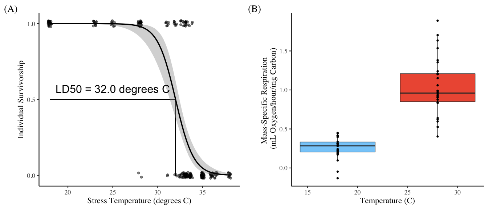
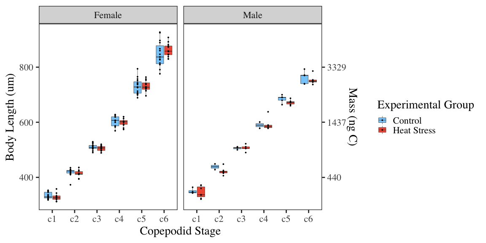
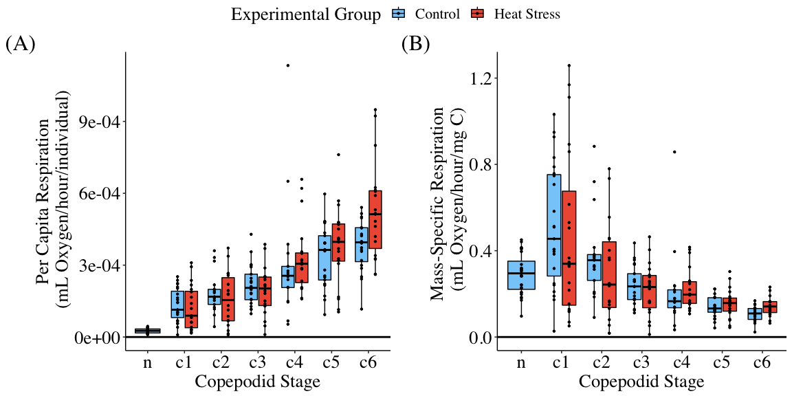
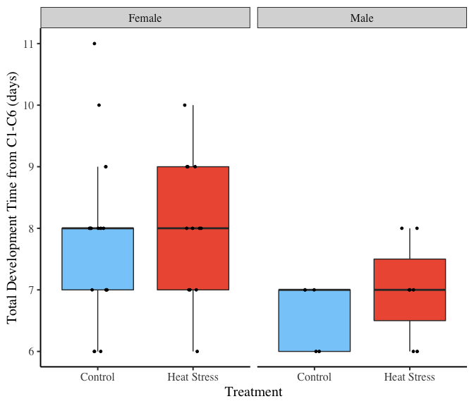
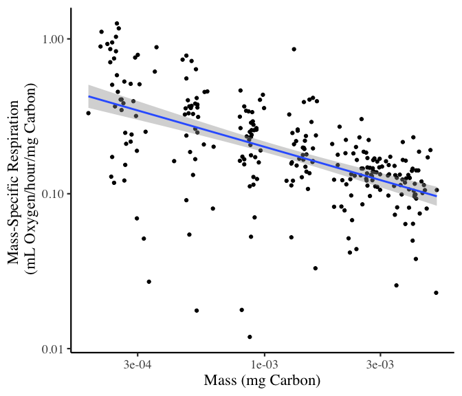
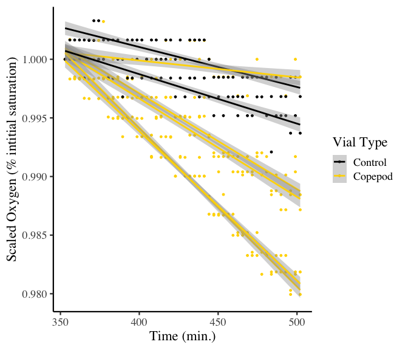
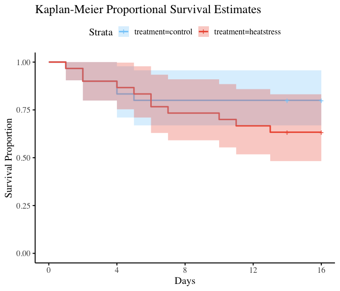

Figures for: Naupliar exposure to acute warming shows no carryover
ontogenetic effects on respiration, body size, or development time in
the copepod Acartia tonsa
================
Mathew Holmes-Hackerd
2022-12-13

-   <a href="#figures" id="toc-figures">Figures</a>
    -   <a href="#figure-1" id="toc-figure-1">Figure 1</a>
    -   <a href="#figure-2" id="toc-figure-2">Figure 2</a>
    -   <a href="#figure-3" id="toc-figure-3">Figure 3</a>
    -   <a href="#figure-4" id="toc-figure-4">Figure 4</a>
    -   <a href="#figure-5" id="toc-figure-5">Figure 5</a>
-   <a href="#tables" id="toc-tables">Tables</a>
    -   <a href="#table-1" id="toc-table-1">Table 1</a>
    -   <a href="#table-2" id="toc-table-2">Table 2</a>
    -   <a href="#table-3" id="toc-table-3">Table 3</a>
-   <a href="#other-statistical-tests"
    id="toc-other-statistical-tests">Other Statistical Tests</a>
-   <a href="#supplemental-information"
    id="toc-supplemental-information">Supplemental Information</a>
    -   <a href="#supp-figure-1" id="toc-supp-figure-1">Supp. Figure 1</a>
    -   <a href="#supp-figure-2" id="toc-supp-figure-2">Supp. Figure 2</a>
    -   <a href="#supp-figure-3" id="toc-supp-figure-3">Supp. Figure 3</a>
    -   <a href="#supp-table-1" id="toc-supp-table-1">Supp. Table 1</a>
    -   <a href="#supp-table-2" id="toc-supp-table-2">Supp. Table 2</a>
    -   <a href="#supp-table-3" id="toc-supp-table-3">Supp. Table 3</a>
    -   <a href="#supp-table-4" id="toc-supp-table-4">Supp. Table 4</a>

``` r
#Kaplan-Meier Analysis for survival, uses survminer package

km_combined = survfit(Surv(death_day, status) ~ treatment, data = surv_data)

summary(km_combined, times = c(1:16))
## Call: survfit(formula = Surv(death_day, status) ~ treatment, data = surv_data)
## 
##                 treatment=control 
##  time n.risk n.event survival std.err lower 95% CI upper 95% CI
##     1     30       1    0.967  0.0328        0.905        1.000
##     2     29       2    0.900  0.0548        0.799        1.000
##     3     27       0    0.900  0.0548        0.799        1.000
##     4     27       2    0.833  0.0680        0.710        0.978
##     5     25       1    0.800  0.0730        0.669        0.957
##     6     24       0    0.800  0.0730        0.669        0.957
##     7     24       0    0.800  0.0730        0.669        0.957
##     8     24       0    0.800  0.0730        0.669        0.957
##     9     24       0    0.800  0.0730        0.669        0.957
##    10     24       0    0.800  0.0730        0.669        0.957
##    11     24       0    0.800  0.0730        0.669        0.957
##    12     24       0    0.800  0.0730        0.669        0.957
##    13     24       0    0.800  0.0730        0.669        0.957
##    14     24       0    0.800  0.0730        0.669        0.957
##    15      7       0    0.800  0.0730        0.669        0.957
##    16      7       0    0.800  0.0730        0.669        0.957
## 
##                 treatment=heatstress 
##  time n.risk n.event survival std.err lower 95% CI upper 95% CI
##     1     30       1    0.967  0.0328        0.905        1.000
##     2     29       2    0.900  0.0548        0.799        1.000
##     3     27       0    0.900  0.0548        0.799        1.000
##     4     27       1    0.867  0.0621        0.753        0.997
##     5     26       1    0.833  0.0680        0.710        0.978
##     6     25       2    0.767  0.0772        0.629        0.934
##     7     23       1    0.733  0.0807        0.591        0.910
##     8     22       0    0.733  0.0807        0.591        0.910
##     9     22       0    0.733  0.0807        0.591        0.910
##    10     22       1    0.700  0.0837        0.554        0.885
##    11     21       1    0.667  0.0861        0.518        0.859
##    12     20       0    0.667  0.0861        0.518        0.859
##    13     20       1    0.633  0.0880        0.482        0.832
##    14     19       0    0.633  0.0880        0.482        0.832
##    15      7       0    0.633  0.0880        0.482        0.832
##    16      7       0    0.633  0.0880        0.482        0.832

S_Fig2 = ggsurvplot(
  fit = survfit(Surv(death_day, status) ~ treatment, data = surv_data),
  xlab = "Days", 
  ylab = "Survival Proportion", 
  title = "Kaplan-Meier Proportional Survival Estimates",
  palette = c("lightskyblue", "tomato2"),
  conf.int = TRUE, 
  pval = FALSE,
  ggtheme = theme_bw(base_size = 15, base_family="serif")+
    theme(panel.grid = element_blank(),
          axis.line.x.bottom = element_line(color = 'black'),
          axis.line.y.left   = element_line(color = 'black'),
          axis.line.y.right  = element_blank(),
          axis.text.y.right  = element_blank(),
          axis.ticks.y.right = element_blank(),
          panel.border       = element_blank(),
          legend.position = "none"
    ))


cox_model <- coxph(Surv(death_day, status) ~ treatment + replicate, data = surv_data)

summary(cox_model)
## Call:
## coxph(formula = Surv(death_day, status) ~ treatment + replicate, 
##     data = surv_data)
## 
##   n= 60, number of events= 17 
## 
##               coef exp(coef) se(coef)      z Pr(>|z|)
## treatment1 -0.3063    0.7361   0.2540 -1.206    0.228
## replicate1  0.1039    1.1094   0.3539  0.293    0.769
## replicate2 -0.6561    0.5189   0.4252 -1.543    0.123
## 
##            exp(coef) exp(-coef) lower .95 upper .95
## treatment1    0.7361     1.3584    0.4474     1.211
## replicate1    1.1094     0.9014    0.5545     2.220
## replicate2    0.5189     1.9273    0.2255     1.194
## 
## Concordance= 0.654  (se = 0.059 )
## Likelihood ratio test= 5.22  on 3 df,   p=0.2
## Wald test            = 4.71  on 3 df,   p=0.2
## Score (logrank) test = 5.07  on 3 df,   p=0.2

S_Fig3 = ggforest(cox_model, data = surv_data)
```

# Figures

## Figure 1

``` r
tolerance = mort_data %>% 
  group_by(population, dev_temp) %>% #Breaks data down into experimental groups (populations, collections, dev. temps)
  group_modify(~ data.frame( #For each of these groups, store these values in a data frame
    "LD50" = unclass( #Use a glm to estimate TPCs and then use those TPCs to estimate LD50
      dose.p(p = 0.5, 
             glm(data = .x, survivorship ~ stress_temp, family = binomial(link = "logit")))),
    "SE" = attr( #What is the SE of the LD50 estimate
      dose.p(p = 0.5,
             glm(data = .x, survivorship ~ stress_temp, family=binomial(link = "logit"))), 
      "SE")))

# Below creates the tpc curve
tpc = ggplot(mort_data, aes(x = stress_temp, y = survivorship)) +
  geom_segment(aes(x=18, xend=tolerance$LD50, y=0.5, yend=0.5)) +
  geom_segment(aes(x=tolerance$LD50, xend=tolerance$LD50, y=0, yend=0.5)) +
  # geom_hline(yintercept = 0.5, size = 1, colour = "gray80") + 
  # geom_vline(xintercept = tolerance$LD50) + 
  geom_point(position=position_jitter(width=0.2, height=0.02), 
             size=2, alpha = 0.5, colour = "black") + 
  geom_smooth(method = "glm", se=T, method.args = list(family = "binomial"), size = 1.2, colour = "black") + 
  scale_y_continuous(breaks = c(0, 0.5, 1)) + 
  xlab("Stress Temperature (degrees C)") +
  ylab("Individual Survivorship") + 
  labs(
    tag = "(A)"
  )+
  theme_bw(base_size = 17, base_family = "serif") +
  annotate("text", x=25, y=0.57,
           label = "LD50 = 32.0 degrees C", 
           col = "black", 
           size = 8) +
  theme(panel.grid = element_blank(),
        axis.line.x.bottom = element_line(color = 'black'),
        axis.line.y.left   = element_line(color = 'black'),
        axis.line.y.right  = element_blank(),
        axis.text.y.right  = element_blank(),
        axis.ticks.y.right = element_blank(),
        panel.border       = element_blank(),
        legend.position = "none"
  )

#Below creates the nauplii msr boxplot
naup_resp = ggplot(data=naup_resp_rates, aes(x = temp, y = msr_B88, fill = factor(temp))) +
  geom_boxplot(outlier.size = 0.0, outlier.shape=NA) +
  geom_point(position = position_dodge(width=0.75)) +
  labs(
    x = "Temperature (C)", 
    y = "Mass-Specific Respiration \n (mL Oxygen/hour/mg Carbon)",
    fill = "Temperature", 
    tag = "(B)"
  )+
  scale_fill_manual(labels = c("18", "28"), values = c("lightskyblue", "tomato2"))+
  # theme_mat()+
  theme_bw(base_size = 17, base_family="serif")+
  theme(panel.grid = element_blank(),
        axis.line.x.bottom = element_line(color = 'black'),
        axis.line.y.left   = element_line(color = 'black'),
        axis.line.y.right  = element_blank(),
        axis.text.y.right  = element_blank(),
        axis.ticks.y.right = element_blank(),
        panel.border       = element_blank(),
        legend.position = "none"
  )

ggarrange(tpc, naup_resp, nrow = 1)
```



## Figure 2

``` r
axis_weights = c(400, 600, 800)
break_weights = (axis_weights^2.92 * (1.11*10^-5))


full_dataset %>% filter(group == "active")%>% drop_na(sex)%>%
  mutate(new_sex = ifelse(sex %in% c("man", "Male", "M", "MALE"), "Male", "Female")) %>%
  ggplot(aes(x=stage, y=length_um, fill=treatment)) +
  facet_grid(.~new_sex) +
  geom_boxplot(lwd=0.25, outlier.shape=NA) +
  geom_point(position = position_dodge(width=0.75), size=0.65) +
  scale_y_continuous(sec.axis=sec_axis(~.^2.92 * (1.11*10^-5), name = "Mass (ng C)", breaks = round(break_weights, digits=0))) +
  scale_fill_manual(labels = c("Control", "Heat Stress"), values = c("lightskyblue", "tomato2")) +
  labs( x = "Copepodid Stage",
        y = "Body Length (um)",
        fill = "Experimental Group") +
  theme_bw(base_size = 21, base_family="serif") +
  theme(panel.grid = element_blank())
```



## Figure 3

``` r
#Creates combined per capita and mass-specific respiration plot
plot_data = full_dataset %>% 
  filter(mass_spec_resp >= 0, group == "active")

temp_naup_resp = naup_resp_rates %>%
  filter(msr_B88>0, temp == "18") %>%
  dplyr::select(10,11)

temp_naup_resp$stage <- "n"
temp_naup_resp$treatment = "control"

names(temp_naup_resp)[2] = "mass_spec_resp"
temp_naup_resp
##        resp_mL_h mass_spec_resp stage treatment
## 1  -4.483746e-05     0.45078516     n   control
## 2  -3.029700e-05     0.30459876     n   control
## 3  -4.122780e-05     0.41449446     n   control
## 4  -3.347084e-05     0.33650781     n   control
## 5  -2.807363e-05     0.28224561     n   control
## 6  -3.943879e-05     0.39650822     n   control
## 7  -4.051310e-05     0.40730903     n   control
## 8  -9.614350e-06     0.09666038     n   control
## 9  -2.804141e-05     0.28192165     n   control
## 10 -4.104596e-05     0.41266626     n   control
## 11 -2.388061e-05     0.28546319     n   control
## 12 -2.675768e-05     0.31985498     n   control
## 13 -1.507671e-05     0.18022341     n   control
## 14 -1.886526e-05     0.22551079     n   control
## 15 -1.716566e-05     0.20519418     n   control
## 16 -2.586087e-05     0.30913465     n   control
## 17 -2.648858e-05     0.31663815     n   control
## 18 -3.446428e-05     0.41197786     n   control
## 19 -3.693470e-05     0.44150861     n   control
## 20 -2.609258e-05     0.31190455     n   control
## 21 -1.302461e-05     0.18417205     n   control
## 22 -1.207957e-05     0.17080888     n   control
## 23 -1.466792e-05     0.20740898     n   control
## 24 -2.251435e-05     0.31836002     n   control
## 25 -1.707390e-05     0.24143028     n   control
## 26 -1.619984e-05     0.22907084     n   control
## 27 -1.397062e-05     0.19754893     n   control
## 28 -1.709480e-05     0.24172585     n   control
temp_naup_resp$resp_mL_h = temp_naup_resp$resp_mL_h * -1

temp_plot_data = plot_data %>%
  ungroup() %>%
  filter(group == "active", mass_spec_resp >0) %>%
  dplyr::select(6,11,12,13)

temp_df_resp = rbind(temp_naup_resp, temp_plot_data)
temp_df_resp$stage = factor(temp_df_resp$stage, levels = c("n", "c1", "c2", "c3", "c4", "c5", "c6"))

panel_labs = c("(a)", "(b)")

#Per capita respiration plot
resp_plot = ggplot(temp_df_resp, aes(x = stage, y = resp_mL_h, fill = treatment, colour = treatment)) + 
  geom_hline(yintercept = 0, size = 1) + 
  geom_boxplot(colour = "black", outlier.shape=NA) +
  geom_point(position = position_dodge(width=0.75),color = "black", size=0.85) + 
  theme_mat(base_size = 10) +
  scale_fill_manual(labels = c("Control", "Heat Stress"), values = c("lightskyblue", "tomato2")) +
  labs(x = "Copepodid Stage",
       y = " Per Capita Respiration \n (mL Oxygen/hour/individual)",
       fill = "Experimental Group",
       tag = "(A)") +
  theme(text = element_text(size = 20, family = "serif")) 

#Mass-specific respiration plot
mass_spec_plot = ggplot(temp_df_resp, aes(x = stage, y = mass_spec_resp, fill = treatment, colour = treatment)) + 
  geom_hline(yintercept = 0, size = 1) + 
  geom_boxplot(colour = "black",outlier.shape=NA) +
  geom_point(position = position_dodge(width = 0.75), color = "black", size = 0.85) + 
  theme_mat(base_size=10) + 
  scale_fill_manual(values = treatment_color_vector)+ 
  labs(x = "Copepodid Stage", 
       y = "Mass-Specific Respiration \n (mL Oxygen/hour/mg C)",
       fill = "Experimental Group",
       tag = "(B)") +
  theme(text = element_text(size = 20,
                            family="serif"))

#Combining the two plots into one figure
ggarrange(resp_plot, mass_spec_plot, nrow = 1, common.legend = T) 
```



## Figure 4

``` r
dev_time_data = molt_record %>% filter(stage %in% c("c1","c6"))%>%
  group_by(id, stage)%>%
  filter(date == min(date), group == "active")%>%
  ungroup(stage)%>%
  mutate("dev_time" = lead(days) - days)%>%
  drop_na("dev_time", "sex") %>%
  dplyr::select(-stage,-days) %>%
  separate(id, c("replicate", "id_original"), sep = "_", remove=F) %>%
  mutate(
    new_sex = ifelse(sex %in% c("man", "Male", "M", "MALE"), "Male", "Female") 
  ) 

xlabs = c("Control", "Heat Stress")


ggplot(dev_time_data, aes(x=treatment, y=dev_time, fill=treatment)) +
  geom_boxplot(outlier.shape=NA) + 
  geom_point(position=position_jitter(width=0.10, height=0.00), size = 1) +
  facet_grid(.~new_sex) +
  scale_fill_manual(labels = c("Control", "Heat Stress"), values = c("lightskyblue", "tomato2")) +
  labs(x = "Treatment",
       y = "Total Development Time from C1-C6 (days)",
       fill = "Experimental Group") +
  theme_bw(base_size = 15, base_family="serif") +
  theme(panel.grid = element_blank(),
        axis.line.x.bottom = element_line(color = 'black'),
        axis.line.y.left   = element_line(color = 'black'),
        axis.line.y.right  = element_blank(),
        axis.text.y.right  = element_blank(),
        axis.ticks.y.right = element_blank(),
        panel.border       = element_blank(),
        legend.position = "none") +
  scale_x_discrete(labels = xlabs)
```



## Figure 5

``` r
full_dataset$msr_nl = full_dataset$mass_spec_resp * 1000000 
full_dataset$weight_mgC = full_dataset$weight_ngC / 1000000

thesisdata= full_dataset %>%
  filter(mass_spec_resp > 0)

df1 = full_dataset %>%
  filter(mass_spec_resp > 0, weight_mgC>0) 

ggplot(aes(x= weight_mgC, y=mass_spec_resp), data=df1)+
  labs(x = "Mass (mg Carbon)",
       y = "Mass-Specific Respiration \n (mL Oxygen/hour/mg Carbon)") +
  geom_point()+
  scale_x_log10()+
  scale_y_log10() +
  geom_smooth(method = "lm", formula = (y~x)) +
  theme_bw(base_size = 17, base_family="serif") +
  theme(panel.grid = element_blank(),
        axis.line.x.bottom = element_line(color = 'black'),
        axis.line.y.left   = element_line(color = 'black'),
        axis.line.y.right  = element_blank(),
        axis.text.y.right  = element_blank(),
        axis.ticks.y.right = element_blank(),
        panel.border       = element_blank(),
        legend.position = "none")
```



``` r

full_dataset$resp_nl_min_ind = (full_dataset$resp_mL_h * (1*10^6) ) / 60
full_dataset$weight_mg = full_dataset$weight_ngC * (1*10^-6)
```

# Tables

## Table 1

``` r
#Remove individuals that didnt make it to C6
plot_data = plot_data %>%
  drop_na(sex)

#Makes all relevant data a factor
plot_data$replicate <- as.factor(plot_data$replicate)
plot_data$id <- as.factor(plot_data$id)
plot_data$treatment <- as.factor(plot_data$treatment)
plot_data$stage <- as.factor(plot_data$stage)
plot_data$sex <- as.factor(plot_data$sex)
plot_data$body_length <- as.factor(plot_data$body_length)

#MUST SET THESE OPTIONS BEFORE RUNNING THE MODELS
options(contrasts=c("contr.sum","contr.poly"))

#All possible model comparisons
msr_m0 <- lme(mass_spec_resp ~ stage * sex* treatment, random = ~1|replicate/id,data = plot_data)
msr_m.1 <- update(msr_m0, weights = varIdent(form = ~1|stage))
msr_m.2 <- update(msr_m0, weights = varIdent(form = ~1|sex))
msr_m.3 <- update(msr_m0, weights = varIdent(form = ~1|treatment))
msr_m.4 <- update(msr_m0, weights = varIdent(form = ~1|stage*sex))
msr_m.5 <- update(msr_m0, weights = varIdent(form = ~1|sex*treatment))
msr_m.6 <- update(msr_m0, weights = varIdent(form = ~1|stage*treatment))
msr_m.7 <- update(msr_m0, weights = varIdent(form = ~1|stage*sex*treatment))

#Comparison of models
#anova(msr_m0,msr_m.1, msr_m.2, msr_m.3, msr_m.4, msr_m.5, msr_m.6, msr_m.7)

#Residual plot
#plot(msr_m.6)
#m.6.e <- resid(msr_m.6, type = 'pearson')

#Q-Q plot
#qqnorm(m.6.e); qqline(m.6.e, col = 2)

#Summary and stats of selected model
#summary(msr_m.6)
kable(car::Anova(msr_m.6, test="F", type = 3))
```

|                     |       Chisq |  Df | Pr(\>Chisq) |
|:--------------------|------------:|----:|------------:|
| (Intercept)         | 178.6376262 |   1 |   0.0000000 |
| stage               |  52.0860365 |   5 |   0.0000000 |
| sex                 |   2.6303843 |   1 |   0.1048363 |
| treatment           |   0.1318189 |   1 |   0.7165536 |
| stage:sex           |   5.6653731 |   5 |   0.3401526 |
| stage:treatment     |   0.3790998 |   5 |   0.9958858 |
| sex:treatment       |   0.9958206 |   1 |   0.3183239 |
| stage:sex:treatment |   5.0681117 |   5 |   0.4076245 |

## Table 2

``` r
#Recreate plot_data df
plot_data = full_dataset %>% 
  filter(mass_spec_resp >= 0, group == "active")
#Remove NAs for sex and body length 
plot_data = plot_data %>%
  drop_na(body_length)%>%
  drop_na(sex) 

#RUN THESE OPTIONS BEFORE THE MODELS
options(contrasts=c("contr.sum","contr.poly"))

#All possible model comparisons
bl_m0 <- lme(body_length ~ stage * sex * treatment, random = ~1|replicate/id, data = plot_data, control =list(msMaxIter = 1000, msMaxEval = 1000))
bl_m.1 <- update(bl_m0, weights = varIdent(form = ~1|stage))
bl_m.2 <- update(bl_m0, weights = varIdent(form = ~1|sex))
bl_m.3 <- update(bl_m0, weights = varIdent(form = ~1|treatment))
bl_m.4 <- update(bl_m0, weights = varIdent(form = ~1|stage*sex))
bl_m.5 <- update(bl_m0, weights = varIdent(form = ~1|sex*treatment))
bl_m.6 <- update(bl_m0, weights = varIdent(form = ~1|stage*treatment))
bl_m.7 <- update(bl_m0, weights = varIdent(form = ~1|stage*sex*treatment))

#Comparison of models
#anova(bl_m0,bl_m.1, bl_m.2, bl_m.3, bl_m.4, bl_m.5, bl_m.6, bl_m.7)

#Residual plot
#plot(bl_m.6)
#m.6.e <- resid(bl_m.6, type = 'pearson')

#Q-Q plot
#qqnorm(m.6.e); qqline(m.6.e, col = 2)

#Summary and stats of selected model
kable(car::Anova(bl_m.6, test="F", type = 3))
```

|                     |        Chisq |  Df | Pr(\>Chisq) |
|:--------------------|-------------:|----:|------------:|
| (Intercept)         | 21092.504660 |   1 |   0.0000000 |
| stage               | 11404.780214 |   5 |   0.0000000 |
| sex                 |    28.131344 |   1 |   0.0000001 |
| treatment           |     2.274059 |   1 |   0.1315550 |
| stage:sex           |   149.023194 |   5 |   0.0000000 |
| stage:treatment     |     3.593029 |   5 |   0.6093603 |
| sex:treatment       |     2.097386 |   1 |   0.1475512 |
| stage:sex:treatment |     9.301372 |   5 |   0.0976306 |

``` r
#summary(bl_m.6)
```

## Table 3

``` r
#RUN THESE OPTIONS BEFORE MODELS
options(contrasts=c("contr.sum","contr.poly"))

#All model comparisons 
dt_m0 <- lme(dev_time ~ sex * treatment, random = ~1|replicate/id,data = dev_time_data,control = lmeControl(opt = "optim"))
dt_m.1 <- update(dt_m0, weights = varIdent(form = ~1|sex))
dt_m.2 <- update(dt_m0, weights = varIdent(form = ~1|treatment))
dt_m.3 <- update(dt_m0, weights = varIdent(form = ~1|sex*treatment))

#Comparisons of models built
#anova(dt_m0,dt_m.1, dt_m.2, dt_m.3)

#Residual plot
#plot(dt_m.3)
#m.3.e <- resid(dt_m.3, type = 'pearson')
#Q-Q plot
#qqnorm(m.3.e); qqline(m.3.e, col = 2)

#Summary and stats of selected model
#summary(dt_m.3)
kable(car::Anova(dt_m.3, test="F", type = 3))
```

|               |      Chisq |  Df | Pr(\>Chisq) |
|:--------------|-----------:|----:|------------:|
| (Intercept)   | 376.576493 |   1 |   0.0000000 |
| sex           |  12.810781 |   1 |   0.0003446 |
| treatment     |   1.684630 |   1 |   0.1943104 |
| sex:treatment |   1.194948 |   1 |   0.2743337 |

# Other Statistical Tests

# Supplemental Information

## Supp. Figure 1

``` r
data_tidyd = o2_record %>% 
  pivot_longer(cols = starts_with(c("Test", "Control")),
               names_to = c("vial"),
               values_to = "O2") %>%  
  mutate("treatment" = if_else(str_detect(vial, "Control"), "Control", "Copepod"),                       
         vial = str_extract(vial, "[:alpha:][:digit:]"),
         "vial_id" = paste(vial, rep, sep = "_")) %>% 
  group_by(vial_id) %>% 
  arrange(Time.Min.) %>% 
  mutate("scaled_O2" = O2 / first(O2)) %>% 
  drop_na(scaled_O2)%>%
  ungroup()%>%
  mutate("label"=paste("Day", rep, sep = " "),
         "label"=fct_reorder(label,rep,min))

#Creates drawdown figure of a single experimental day
data_tidyd %>%
  filter(day_id == "R1_3_24")%>%
  ggplot(aes(x = Time.Min., y = scaled_O2, colour = treatment, group = vial)) +
  scale_color_manual(values = group_color_vector1) + 
  labs(x= "Time (min.)",
       y="Scaled Oxygen (% intitial saturation)", 
       colour = "Vial Type") +
  geom_point(size = 1) + 
  theme(panel.grid = element_blank())+
  geom_smooth(method = "lm") +
  theme_bw(base_size = 17, base_family="serif")+
  theme(panel.grid = element_blank(),
        axis.line.x.bottom = element_line(color = 'black'),
        axis.line.y.left   = element_line(color = 'black'),
        axis.line.y.right  = element_blank(),
        axis.text.y.right  = element_blank(),
        axis.ticks.y.right = element_blank(),
        panel.border       = element_blank())
```



## Supp. Figure 2

``` r
S_Fig2
```



## Supp. Figure 3

``` r
S_Fig3
```


## Supp. Table 1

``` r
#Emmeans post-hoc analysis of selected body length model
kable(emmeans::emmeans(bl_m.6,  pairwise ~ stage : sex )$emmeans)
```

| stage | sex |    emmean |        SE |  df |  lower.CL |  upper.CL |
|:------|:----|----------:|----------:|----:|----------:|----------:|
| c1    | F   | 0.3320107 | 0.0048842 |   2 | 0.3109956 | 0.3530259 |
| c2    | F   | 0.4167250 | 0.0045330 |   2 | 0.3972210 | 0.4362291 |
| c3    | F   | 0.5058536 | 0.0038732 |   2 | 0.4891884 | 0.5225187 |
| c4    | F   | 0.6018018 | 0.0042093 |   2 | 0.5836909 | 0.6199128 |
| c5    | F   | 0.7304823 | 0.0049517 |   2 | 0.7091769 | 0.7517878 |
| c6    | F   | 0.8539941 | 0.0065242 |   2 | 0.8259227 | 0.8820654 |
| c1    | M   | 0.3444095 | 0.0063284 |   2 | 0.3171807 | 0.3716383 |
| c2    | M   | 0.4385893 | 0.0101498 |   2 | 0.3949182 | 0.4822604 |
| c3    | M   | 0.5036019 | 0.0048559 |   2 | 0.4827084 | 0.5244953 |
| c4    | M   | 0.5850059 | 0.0062787 |   2 | 0.5579907 | 0.6120211 |
| c5    | M   | 0.6769211 | 0.0067404 |   2 | 0.6479195 | 0.7059227 |
| c6    | M   | 0.7565545 | 0.0099720 |   2 | 0.7136486 | 0.7994603 |

## Supp. Table 2

``` r
c6_handling_anova = full_dataset %>%
  filter(stage == "c6")
#Comparison of C6 mass-spec resp between actively handled and handling controls

#RUN THESE OPTIONS BEFORE MODELS
options(contrasts=c("contr.sum","contr.poly"))

msrh_m0 <- lme(mass_spec_resp ~ group * sex* treatment, random = ~1|replicate/id,data = c6_handling_anova)
msrh_m.1 <- update(msrh_m0, weights = varIdent(form = ~1|stage))
msrh_m.2 <- update(msrh_m0, weights = varIdent(form = ~1|sex))
msrh_m.3 <- update(msrh_m0, weights = varIdent(form = ~1|treatment))
msrh_m.4 <- update(msrh_m0, weights = varIdent(form = ~1|stage*sex))
msrh_m.5 <- update(msrh_m0, weights = varIdent(form = ~1|sex*treatment))
msrh_m.6 <- update(msrh_m0, weights = varIdent(form = ~1|stage*treatment))
msrh_m.7 <- update(msrh_m0, weights = varIdent(form = ~1|stage*sex*treatment))

#anova(msrh_m0,msrh_m.1, msrh_m.2, msrh_m.3, msrh_m.4, msrh_m.5, msrh_m.6, msrh_m.7)

kable(car::Anova(msrh_m.4, Test="F", type = 3))
```

|                     |       Chisq |  Df | Pr(\>Chisq) |
|:--------------------|------------:|----:|------------:|
| (Intercept)         | 835.3960324 |   1 |   0.0000000 |
| group               |   1.0972123 |   1 |   0.2948787 |
| sex                 |   2.8282168 |   1 |   0.0926211 |
| treatment           |   2.0103233 |   1 |   0.1562320 |
| group:sex           |   0.2430094 |   1 |   0.6220410 |
| group:treatment     |   0.9384343 |   1 |   0.3326808 |
| sex:treatment       |   3.1962510 |   1 |   0.0738073 |
| group:sex:treatment |   1.2079614 |   1 |   0.2717362 |

## Supp. Table 3

``` r
#Comparison of C6 body lengths between actively handled and handling controls
blh_m0 <- lme(body_length ~ group * sex* treatment, random = ~1|replicate/id,data = c6_handling_anova)
blh_m.1 <- update(blh_m0, weights = varIdent(form = ~1|stage))
blh_m.2 <- update(blh_m0, weights = varIdent(form = ~1|sex))
blh_m.3 <- update(blh_m0, weights = varIdent(form = ~1|treatment))
blh_m.4 <- update(blh_m0, weights = varIdent(form = ~1|stage*sex))
blh_m.5 <- update(blh_m0, weights = varIdent(form = ~1|sex*treatment))
blh_m.6 <- update(blh_m0, weights = varIdent(form = ~1|stage*treatment))
blh_m.7 <- update(blh_m0, weights = varIdent(form = ~1|stage*sex*treatment))

#anova(blh_m0,blh_m.1, blh_m.2, blh_m.3, blh_m.4, blh_m.5, blh_m.6, blh_m.7)

kable(car::Anova(blh_m0, Test="F", type = 3))
```

|                     |        Chisq |  Df | Pr(\>Chisq) |
|:--------------------|-------------:|----:|------------:|
| (Intercept)         | 3320.6055052 |   1 |   0.0000000 |
| group               |    0.7898268 |   1 |   0.3741525 |
| sex                 |  148.7237551 |   1 |   0.0000000 |
| treatment           |    1.1890434 |   1 |   0.2755226 |
| group:sex           |    0.0003836 |   1 |   0.9843743 |
| group:treatment     |    0.7020162 |   1 |   0.4021071 |
| sex:treatment       |    0.0897605 |   1 |   0.7644819 |
| group:sex:treatment |    0.9611761 |   1 |   0.3268907 |

## Supp. Table 4

``` r
#Comparison of copepodid dev time between actively handled and handling controls 

#Remake dev time data df
dev_time_data = molt_record %>% filter(stage %in% c("c1","c6"))%>%
  group_by(id, stage)%>%
  filter(date == min(date))%>%
  ungroup(stage)%>%
  mutate("dev_time" = lead(days) - days)%>%
  drop_na("dev_time", "sex") %>%
  dplyr::select(-stage,-days) %>%
  separate(id, c("replicate", "id_original"), sep = "_", remove=F)

#RUN THESE OPTIONS BEFORE MODELS
options(contrasts=c("contr.sum","contr.poly"))

dth_m0 <- lme(dev_time ~ group* sex * treatment, random = ~1|replicate/id,data = dev_time_data,control = lmeControl(opt = "optim"))
dth_m.1 <- update(dth_m0, weights = varIdent(form = ~1|sex))
dth_m.2 <- update(dth_m0, weights = varIdent(form = ~1|treatment))
dth_m.3 <- update(dth_m0, weights = varIdent(form = ~1|sex*treatment))

#Comparisons of models built
#anova(dth_m0,dth_m.1, dth_m.2, dth_m.3)

#Residual plot
#plot(dth_m.3)
#m.3.e <- resid(dth_m.3, type = 'pearson')
#Q-Q plot
#qqnorm(m.3.e); qqline(m.3.e, col = 2)

#Summary and stats of selected model
#summary(dth_m.3)
kable(car::Anova(dth_m.3, test="F", type = 3))
```

|                     |       Chisq |  Df | Pr(\>Chisq) |
|:--------------------|------------:|----:|------------:|
| (Intercept)         | 452.7626813 |   1 |   0.0000000 |
| group               |   2.8462378 |   1 |   0.0915880 |
| sex                 |   6.6633600 |   1 |   0.0098415 |
| treatment           |   2.7174651 |   1 |   0.0992555 |
| group:sex           |   1.1535458 |   1 |   0.2828081 |
| group:treatment     |   0.1083140 |   1 |   0.7420719 |
| sex:treatment       |   0.0149619 |   1 |   0.9026465 |
| group:sex:treatment |   1.4722037 |   1 |   0.2249983 |
