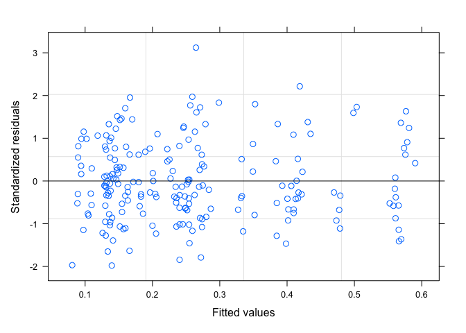
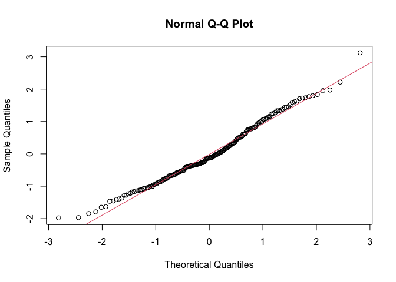
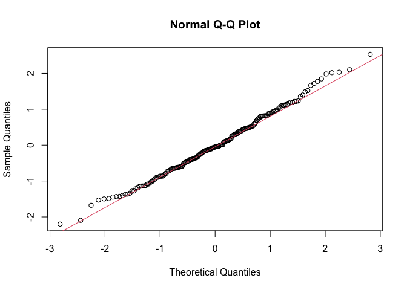
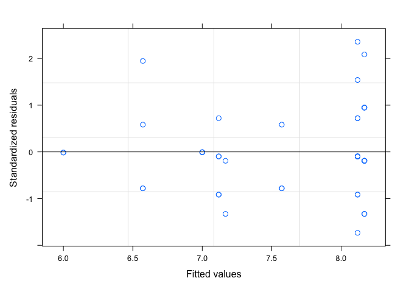
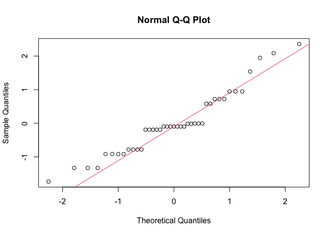
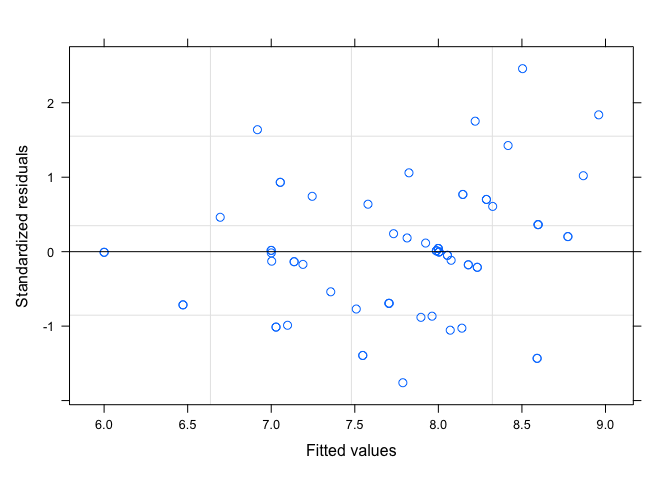
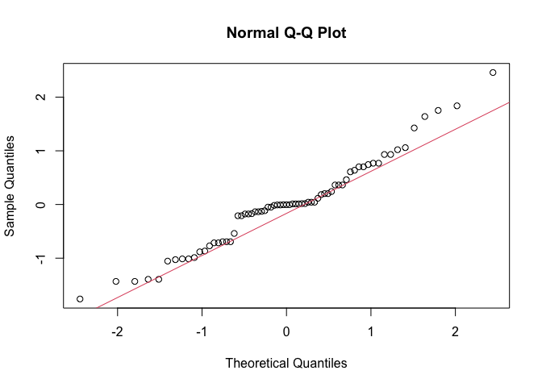

Figures for: Naupliar exposure to acute warming shows no carryover
ontogenetic effects on respiration, body size, or development time in
the copepod Acartia tonsa
================
Mathew Holmes-Hackerd
2022-12-13

-   <a href="#figures" id="toc-figures">Figures</a>
    -   <a href="#figure-1" id="toc-figure-1">Figure 1</a>
    -   <a href="#figure-2" id="toc-figure-2">Figure 2</a>
    -   <a href="#figure-3" id="toc-figure-3">Figure 3</a>
    -   <a href="#figure-4" id="toc-figure-4">Figure 4</a>
    -   <a href="#figure-5" id="toc-figure-5">Figure 5</a>
-   <a href="#tables" id="toc-tables">Tables</a>
    -   <a href="#table-1" id="toc-table-1">Table 1</a>
    -   <a href="#table-2" id="toc-table-2">Table 2</a>
    -   <a href="#table-3" id="toc-table-3">Table 3</a>
-   <a href="#other-statistical-tests"
    id="toc-other-statistical-tests">Other Statistical Tests</a>
-   <a href="#supplemental-information"
    id="toc-supplemental-information">Supplemental Information</a>
    -   <a href="#supp-figure-1" id="toc-supp-figure-1">Supp. Figure 1</a>
    -   <a href="#supp-figure-2" id="toc-supp-figure-2">Supp. Figure 2</a>
    -   <a href="#supp-figure-3" id="toc-supp-figure-3">Supp. Figure 3</a>
    -   <a href="#supp-table-1" id="toc-supp-table-1">Supp. Table 1</a>
    -   <a href="#supp-table-2" id="toc-supp-table-2">Supp. Table 2</a>
    -   <a href="#supp-table-3" id="toc-supp-table-3">Supp. Table 3</a>
    -   <a href="#supp-table-4" id="toc-supp-table-4">Supp. Table 4</a>

``` r
#Kaplan-Meier Analysis for survival, uses survminer package

km_combined = survfit(Surv(death_day, status) ~ treatment, data = surv_data)

summary(km_combined, times = c(1:16))
## Call: survfit(formula = Surv(death_day, status) ~ treatment, data = surv_data)
## 
##                 treatment=control 
##  time n.risk n.event survival std.err lower 95% CI upper 95% CI
##     1     30       1    0.967  0.0328        0.905        1.000
##     2     29       2    0.900  0.0548        0.799        1.000
##     3     27       0    0.900  0.0548        0.799        1.000
##     4     27       2    0.833  0.0680        0.710        0.978
##     5     25       1    0.800  0.0730        0.669        0.957
##     6     24       0    0.800  0.0730        0.669        0.957
##     7     24       0    0.800  0.0730        0.669        0.957
##     8     24       0    0.800  0.0730        0.669        0.957
##     9     24       0    0.800  0.0730        0.669        0.957
##    10     24       0    0.800  0.0730        0.669        0.957
##    11     24       0    0.800  0.0730        0.669        0.957
##    12     24       0    0.800  0.0730        0.669        0.957
##    13     24       0    0.800  0.0730        0.669        0.957
##    14     24       0    0.800  0.0730        0.669        0.957
##    15      7       0    0.800  0.0730        0.669        0.957
##    16      7       0    0.800  0.0730        0.669        0.957
## 
##                 treatment=heatstress 
##  time n.risk n.event survival std.err lower 95% CI upper 95% CI
##     1     30       1    0.967  0.0328        0.905        1.000
##     2     29       2    0.900  0.0548        0.799        1.000
##     3     27       0    0.900  0.0548        0.799        1.000
##     4     27       1    0.867  0.0621        0.753        0.997
##     5     26       1    0.833  0.0680        0.710        0.978
##     6     25       2    0.767  0.0772        0.629        0.934
##     7     23       1    0.733  0.0807        0.591        0.910
##     8     22       0    0.733  0.0807        0.591        0.910
##     9     22       0    0.733  0.0807        0.591        0.910
##    10     22       1    0.700  0.0837        0.554        0.885
##    11     21       1    0.667  0.0861        0.518        0.859
##    12     20       0    0.667  0.0861        0.518        0.859
##    13     20       1    0.633  0.0880        0.482        0.832
##    14     19       0    0.633  0.0880        0.482        0.832
##    15      7       0    0.633  0.0880        0.482        0.832
##    16      7       0    0.633  0.0880        0.482        0.832

S_Fig2 = ggsurvplot(
  fit = survfit(Surv(death_day, status) ~ treatment, data = surv_data),
  xlab = "Days", 
  ylab = "Survival Proportion", 
  title = "Kaplan-Meier Proportional Survival Estimates",
  palette = c("lightskyblue", "tomato2"),
  conf.int = TRUE, 
  pval = FALSE,
  ggtheme = theme_bw(base_size = 15, base_family="serif")+
    theme(panel.grid = element_blank(),
          axis.line.x.bottom = element_line(color = 'black'),
          axis.line.y.left   = element_line(color = 'black'),
          axis.line.y.right  = element_blank(),
          axis.text.y.right  = element_blank(),
          axis.ticks.y.right = element_blank(),
          panel.border       = element_blank(),
          legend.position = "none"
    ))


cox_model <- coxph(Surv(death_day, status) ~ treatment + replicate, data = surv_data)

summary(cox_model)
## Call:
## coxph(formula = Surv(death_day, status) ~ treatment + replicate, 
##     data = surv_data)
## 
##   n= 60, number of events= 17 
## 
##               coef exp(coef) se(coef)      z Pr(>|z|)
## treatment1 -0.3063    0.7361   0.2540 -1.206    0.228
## replicate1  0.1039    1.1094   0.3539  0.293    0.769
## replicate2 -0.6561    0.5189   0.4252 -1.543    0.123
## 
##            exp(coef) exp(-coef) lower .95 upper .95
## treatment1    0.7361     1.3584    0.4474     1.211
## replicate1    1.1094     0.9014    0.5545     2.220
## replicate2    0.5189     1.9273    0.2255     1.194
## 
## Concordance= 0.654  (se = 0.059 )
## Likelihood ratio test= 5.22  on 3 df,   p=0.2
## Wald test            = 4.71  on 3 df,   p=0.2
## Score (logrank) test = 5.07  on 3 df,   p=0.2

S_Fig3 = ggforest(cox_model, data = surv_data)
```

# Figures

## Figure 1

``` r
tolerance = mort_data %>% 
  group_by(population, dev_temp) %>% #Breaks data down into experimental groups (populations, collections, dev. temps)
  group_modify(~ data.frame( #For each of these groups, store these values in a data frame
    "LD50" = unclass( #Use a glm to estimate TPCs and then use those TPCs to estimate LD50
      dose.p(p = 0.5, 
             glm(data = .x, survivorship ~ stress_temp, family = binomial(link = "logit")))),
    "SE" = attr( #What is the SE of the LD50 estimate
      dose.p(p = 0.5,
             glm(data = .x, survivorship ~ stress_temp, family=binomial(link = "logit"))), 
      "SE")))

# Below creates the tpc curve
tpc = ggplot(mort_data, aes(x = stress_temp, y = survivorship)) +
  geom_segment(aes(x=18, xend=tolerance$LD50, y=0.5, yend=0.5)) +
  geom_segment(aes(x=tolerance$LD50, xend=tolerance$LD50, y=0, yend=0.5)) +
  # geom_hline(yintercept = 0.5, size = 1, colour = "gray80") + 
  # geom_vline(xintercept = tolerance$LD50) + 
  geom_point(position=position_jitter(width=0.2, height=0.02), 
             size=2, alpha = 0.5, colour = "black") + 
  geom_smooth(method = "glm", se=T, method.args = list(family = "binomial"), size = 1.2, colour = "black") + 
  scale_y_continuous(breaks = c(0, 0.5, 1)) + 
  xlab("Stress Temperature (degrees C)") +
  ylab("Individual Survivorship") + 
  labs(
    tag = "(A)"
  )+
  theme_bw(base_size = 17, base_family = "serif") +
  annotate("text", x=25, y=0.57,
           label = "LD50 = 32.0 degrees C", 
           col = "black", 
           size = 8) +
  theme(panel.grid = element_blank(),
        axis.line.x.bottom = element_line(color = 'black'),
        axis.line.y.left   = element_line(color = 'black'),
        axis.line.y.right  = element_blank(),
        axis.text.y.right  = element_blank(),
        axis.ticks.y.right = element_blank(),
        panel.border       = element_blank(),
        legend.position = "none"
  )

#Below creates the nauplii msr boxplot
naup_resp = ggplot(data=naup_resp_rates, aes(x = temp, y = msr_B88, fill = factor(temp))) +
  geom_boxplot(outlier.size = 0.0, outlier.shape=NA) +
  geom_point(position = position_dodge(width=0.75)) +
  labs(
    x = "Temperature (C)", 
    y = "Mass-Specific Respiration \n (mL Oxygen/hour/mg Carbon)",
    fill = "Temperature", 
    tag = "(B)"
  )+
  scale_fill_manual(labels = c("18", "28"), values = c("lightskyblue", "tomato2"))+
  # theme_mat()+
  theme_bw(base_size = 17, base_family="serif")+
  theme(panel.grid = element_blank(),
        axis.line.x.bottom = element_line(color = 'black'),
        axis.line.y.left   = element_line(color = 'black'),
        axis.line.y.right  = element_blank(),
        axis.text.y.right  = element_blank(),
        axis.ticks.y.right = element_blank(),
        panel.border       = element_blank(),
        legend.position = "none"
  )

ggarrange(tpc, naup_resp, nrow = 1)
```


## Figure 2

``` r
axis_weights = c(400, 600, 800)
break_weights = (axis_weights^2.92 * (1.11*10^-5))


full_dataset %>% filter(group == "active")%>% drop_na(sex)%>%
  mutate(new_sex = ifelse(sex %in% c("man", "Male", "M", "MALE"), "Male", "Female")) %>%
  ggplot(aes(x=stage, y=length_um, fill=treatment)) +
  facet_grid(.~new_sex) +
  geom_boxplot(lwd=0.25, outlier.shape=NA) +
  geom_point(position = position_dodge(width=0.75), size=0.65) +
  scale_y_continuous(sec.axis=sec_axis(~.^2.92 * (1.11*10^-5), name = "Mass (ng C)", breaks = round(break_weights, digits=0))) +
  scale_fill_manual(labels = c("Control", "Heat Stress"), values = c("lightskyblue", "tomato2")) +
  labs( x = "Copepodid Stage",
        y = "Body Length (um)",
        fill = "Experimental Group") +
  theme_bw(base_size = 21, base_family="serif") +
  theme(panel.grid = element_blank())
```


## Figure 3

``` r
#Creates combined per capita and mass-specific respiration plot
plot_data = full_dataset %>% 
  filter(mass_spec_resp >= 0, group == "active")

temp_naup_resp = naup_resp_rates %>%
  filter(msr_B88>0, temp == "18") %>%
  dplyr::select(10,11)

temp_naup_resp$stage <- "n"
temp_naup_resp$treatment = "control"

names(temp_naup_resp)[2] = "mass_spec_resp"
temp_naup_resp
##        resp_mL_h mass_spec_resp stage treatment
## 1  -4.483746e-05     0.45078516     n   control
## 2  -3.029700e-05     0.30459876     n   control
## 3  -4.122780e-05     0.41449446     n   control
## 4  -3.347084e-05     0.33650781     n   control
## 5  -2.807363e-05     0.28224561     n   control
## 6  -3.943879e-05     0.39650822     n   control
## 7  -4.051310e-05     0.40730903     n   control
## 8  -9.614350e-06     0.09666038     n   control
## 9  -2.804141e-05     0.28192165     n   control
## 10 -4.104596e-05     0.41266626     n   control
## 11 -2.388061e-05     0.28546319     n   control
## 12 -2.675768e-05     0.31985498     n   control
## 13 -1.507671e-05     0.18022341     n   control
## 14 -1.886526e-05     0.22551079     n   control
## 15 -1.716566e-05     0.20519418     n   control
## 16 -2.586087e-05     0.30913465     n   control
## 17 -2.648858e-05     0.31663815     n   control
## 18 -3.446428e-05     0.41197786     n   control
## 19 -3.693470e-05     0.44150861     n   control
## 20 -2.609258e-05     0.31190455     n   control
## 21 -1.302461e-05     0.18417205     n   control
## 22 -1.207957e-05     0.17080888     n   control
## 23 -1.466792e-05     0.20740898     n   control
## 24 -2.251435e-05     0.31836002     n   control
## 25 -1.707390e-05     0.24143028     n   control
## 26 -1.619984e-05     0.22907084     n   control
## 27 -1.397062e-05     0.19754893     n   control
## 28 -1.709480e-05     0.24172585     n   control
temp_naup_resp$resp_mL_h = temp_naup_resp$resp_mL_h * -1

temp_plot_data = plot_data %>%
  ungroup() %>%
  filter(group == "active", mass_spec_resp >0) %>%
  dplyr::select(6,11,12,13)

temp_df_resp = rbind(temp_naup_resp, temp_plot_data)
temp_df_resp$stage = factor(temp_df_resp$stage, levels = c("n", "c1", "c2", "c3", "c4", "c5", "c6"))

panel_labs = c("(a)", "(b)")

#Per capita respiration plot
resp_plot = ggplot(temp_df_resp, aes(x = stage, y = resp_mL_h, fill = treatment, colour = treatment)) + 
  geom_hline(yintercept = 0, size = 1) + 
  geom_boxplot(colour = "black", outlier.shape=NA) +
  geom_point(position = position_dodge(width=0.75),color = "black", size=0.85) + 
  theme_mat(base_size = 10) +
  scale_fill_manual(labels = c("Control", "Heat Stress"), values = c("lightskyblue", "tomato2")) +
  labs(x = "Copepodid Stage",
       y = " Per Capita Respiration \n (mL Oxygen/hour/individual)",
       fill = "Experimental Group",
       tag = "(A)") +
  theme(text = element_text(size = 20, family = "serif")) 

#Mass-specific respiration plot
mass_spec_plot = ggplot(temp_df_resp, aes(x = stage, y = mass_spec_resp, fill = treatment, colour = treatment)) + 
  geom_hline(yintercept = 0, size = 1) + 
  geom_boxplot(colour = "black",outlier.shape=NA) +
  geom_point(position = position_dodge(width = 0.75), color = "black", size = 0.85) + 
  theme_mat(base_size=10) + 
  scale_fill_manual(values = treatment_color_vector)+ 
  labs(x = "Copepodid Stage", 
       y = "Mass-Specific Respiration \n (mL Oxygen/hour/mg C)",
       fill = "Experimental Group",
       tag = "(B)") +
  theme(text = element_text(size = 20,
                            family="serif"))

#Combining the two plots into one figure
ggarrange(resp_plot, mass_spec_plot, nrow = 1, common.legend = T) 
```


## Figure 4

``` r
dev_time_data = molt_record %>% filter(stage %in% c("c1","c6"))%>%
  group_by(id, stage)%>%
  filter(date == min(date), group == "active")%>%
  ungroup(stage)%>%
  mutate("dev_time" = lead(days) - days)%>%
  drop_na("dev_time", "sex") %>%
  dplyr::select(-stage,-days) %>%
  separate(id, c("replicate", "id_original"), sep = "_", remove=F) %>%
  mutate(
    new_sex = ifelse(sex %in% c("man", "Male", "M", "MALE"), "Male", "Female") 
  ) 

xlabs = c("Control", "Heat Stress")


ggplot(dev_time_data, aes(x=treatment, y=dev_time, fill=treatment)) +
  geom_boxplot(outlier.shape=NA) + 
  geom_point(position=position_jitter(width=0.10, height=0.00), size = 1) +
  facet_grid(.~new_sex) +
  scale_fill_manual(labels = c("Control", "Heat Stress"), values = c("lightskyblue", "tomato2")) +
  labs(x = "Treatment",
       y = "Total Development Time from C1-C6 (days)",
       fill = "Experimental Group") +
  theme_bw(base_size = 15, base_family="serif") +
  theme(panel.grid = element_blank(),
        axis.line.x.bottom = element_line(color = 'black'),
        axis.line.y.left   = element_line(color = 'black'),
        axis.line.y.right  = element_blank(),
        axis.text.y.right  = element_blank(),
        axis.ticks.y.right = element_blank(),
        panel.border       = element_blank(),
        legend.position = "none") +
  scale_x_discrete(labels = xlabs)
```


## Figure 5

``` r
full_dataset$msr_nl = full_dataset$mass_spec_resp * 1000000 
full_dataset$weight_mgC = full_dataset$weight_ngC / 1000000

thesisdata= full_dataset %>%
  filter(mass_spec_resp > 0)

df1 = full_dataset %>%
  filter(mass_spec_resp > 0, weight_mgC>0) 

ggplot(aes(x= weight_mgC, y=mass_spec_resp), data=df1)+
  labs(x = "Mass (mg Carbon)",
       y = "Mass-Specific Respiration \n (mL Oxygen/hour/mg Carbon)") +
  geom_point()+
  scale_x_log10()+
  scale_y_log10() +
  geom_smooth(method = "lm", formula = (y~x)) +
  theme_bw(base_size = 17, base_family="serif") +
  theme(panel.grid = element_blank(),
        axis.line.x.bottom = element_line(color = 'black'),
        axis.line.y.left   = element_line(color = 'black'),
        axis.line.y.right  = element_blank(),
        axis.text.y.right  = element_blank(),
        axis.ticks.y.right = element_blank(),
        panel.border       = element_blank(),
        legend.position = "none")
```


``` r

full_dataset$resp_nl_min_ind = (full_dataset$resp_mL_h * (1*10^6) ) / 60
full_dataset$weight_mg = full_dataset$weight_ngC * (1*10^-6)
```

# Tables

## Table 1

``` r
#Remove individuals that didnt make it to C6
plot_data = plot_data %>%
  drop_na(sex)

#Makes all relevant data a factor
plot_data$replicate <- as.factor(plot_data$replicate)
plot_data$id <- as.factor(plot_data$id)
plot_data$treatment <- as.factor(plot_data$treatment)
plot_data$stage <- as.factor(plot_data$stage)
plot_data$sex <- as.factor(plot_data$sex)
plot_data$body_length <- as.factor(plot_data$body_length)

#MUST SET THESE OPTIONS BEFORE RUNNING THE MODELS
options(contrasts=c("contr.sum","contr.poly"))

#All possible model comparisons
msr_m0 <- lme(mass_spec_resp ~ stage * sex* treatment, random = ~1|replicate/id,data = plot_data)
msr_m.1 <- update(msr_m0, weights = varIdent(form = ~1|stage))
msr_m.2 <- update(msr_m0, weights = varIdent(form = ~1|sex))
msr_m.3 <- update(msr_m0, weights = varIdent(form = ~1|treatment))
msr_m.4 <- update(msr_m0, weights = varIdent(form = ~1|stage*sex))
msr_m.5 <- update(msr_m0, weights = varIdent(form = ~1|sex*treatment))
msr_m.6 <- update(msr_m0, weights = varIdent(form = ~1|stage*treatment))
msr_m.7 <- update(msr_m0, weights = varIdent(form = ~1|stage*sex*treatment))

#Comparison of models
anova(msr_m0,msr_m.1, msr_m.2, msr_m.3, msr_m.4, msr_m.5, msr_m.6, msr_m.7)
##         Model df        AIC       BIC    logLik   Test   L.Ratio p-value
## msr_m0      1 27    0.40099  86.90917  26.79950                         
## msr_m.1     2 32 -125.67174 -23.14353  94.83587 1 vs 2 136.07274  <.0001
## msr_m.2     3 28    2.36043  92.07261  26.81979 2 vs 3 136.03217  <.0001
## msr_m.3     4 28    2.28492  91.99710  26.85754                         
## msr_m.4     5 38 -123.37788  -1.62562  99.68894 4 vs 5 145.66279  <.0001
## msr_m.5     6 30    6.00905 102.12925  26.99547 5 vs 6 145.38693  <.0001
## msr_m.6     7 38 -128.62134  -6.86908 102.31067 6 vs 7 150.63039  <.0001
## msr_m.7     8 50 -114.22017  45.98016 107.11009 7 vs 8   9.59883  0.6511

#Residual plot
plot(msr_m.6)
```



``` r
m.6.e <- resid(msr_m.6, type = 'pearson')

#Q-Q plot
qqnorm(m.6.e); qqline(m.6.e, col = 2)
```



``` r

#Summary and stats of selected model
summary(msr_m.6)
## Linear mixed-effects model fit by REML
##   Data: plot_data 
##         AIC       BIC   logLik
##   -128.6213 -6.869083 102.3107
## 
## Random effects:
##  Formula: ~1 | replicate
##         (Intercept)
## StdDev:   0.0121658
## 
##  Formula: ~1 | id %in% replicate
##         (Intercept)  Residual
## StdDev:   0.0120096 0.3844564
## 
## Variance function:
##  Structure: Different standard deviations per stratum
##  Formula: ~1 | stage * treatment 
##  Parameter estimates:
## c1*heatstress c2*heatstress c3*heatstress c4*heatstress c5*heatstress c6*heatstress    c1*control    c3*control    c5*control    c6*control    c2*control    c4*control 
##    1.00000000    0.61855412    0.32225798    0.21949748    0.18219987    0.10992402    0.72554318    0.23310489    0.12878768    0.07646048    0.54565561    0.49423276 
## Fixed effects:  mass_spec_resp ~ stage * sex * treatment 
##                              Value  Std.Error  DF   t-value p-value
## (Intercept)             0.24757438 0.01852334 145 13.365539  0.0000
## stage1                  0.21836065 0.05653471 145  3.862418  0.0002
## stage2                  0.06239019 0.05406047 145  1.154081  0.2504
## stage3                 -0.02022291 0.02468009 145 -0.819402  0.4139
## stage4                 -0.04459256 0.03523830 145 -1.265457  0.2077
## stage5                 -0.09887333 0.01917217 145 -5.157127  0.0000
## sex1                    0.02785695 0.01717608  35  1.621846  0.1138
## treatment1             -0.00621445 0.01711646  35 -0.363069  0.7187
## stage1:sex1             0.03266264 0.05653539 145  0.577738  0.5643
## stage2:sex1             0.03579632 0.05405814 145  0.662182  0.5089
## stage3:sex1            -0.01860476 0.02467214 145 -0.754079  0.4520
## stage4:sex1             0.02052494 0.03523266 145  0.582554  0.5611
## stage5:sex1            -0.03075944 0.01917157 145 -1.604430  0.1108
## stage1:treatment1       0.01972841 0.05653467 145  0.348961  0.7276
## stage2:treatment1       0.00486570 0.05405781 145  0.090009  0.9284
## stage3:treatment1       0.00251669 0.02466849 145  0.102020  0.9189
## stage4:treatment1      -0.01754152 0.03523404 145 -0.497857  0.6193
## stage5:treatment1      -0.00511196 0.01917676 145 -0.266570  0.7902
## sex1:treatment1         0.01708426 0.01712007  35  0.997908  0.3252
## stage1:sex1:treatment1  0.01136705 0.05653700 145  0.201055  0.8409
## stage2:sex1:treatment1  0.01947190 0.05406418 145  0.360163  0.7192
## stage3:sex1:treatment1  0.01199249 0.02467206 145  0.486076  0.6276
## stage4:sex1:treatment1 -0.00187171 0.03523574 145 -0.053120  0.9577
## stage5:sex1:treatment1 -0.01258740 0.01918143 145 -0.656229  0.5127
##  Correlation: 
##                        (Intr) stage1 stage2 stage3 stage4 stage5 sex1   trtmn1 stg1:s1 stg2:s1 stg3:s1 stg4:s1 stg5:s1 stg1:t1 stg2:t1 stg3:t1 stg4:t1 stg5:t1 sx1:t1 s1:1:1
## stage1                  0.419                                                                                                                                               
## stage2                  0.369 -0.359                                                                                                                                        
## stage3                 -0.457 -0.371 -0.339                                                                                                                                 
## stage4                 -0.075 -0.340 -0.319 -0.035                                                                                                                          
## stage5                 -0.757 -0.423 -0.376  0.399  0.044                                                                                                                   
## sex1                   -0.464 -0.049 -0.337  0.248 -0.041  0.417                                                                                                            
## treatment1              0.148 -0.282  0.307 -0.143  0.249 -0.160 -0.380                                                                                                     
## stage1:sex1            -0.045 -0.285  0.165  0.062  0.108  0.051  0.451 -0.008                                                                                              
## stage2:sex1            -0.312  0.165 -0.675  0.266  0.251  0.309  0.400 -0.304 -0.359                                                                                       
## stage3:sex1             0.229  0.062  0.266 -0.504  0.074 -0.205 -0.494  0.250 -0.371  -0.339                                                                               
## stage4:sex1            -0.037  0.108  0.251  0.074 -0.658  0.046 -0.082 -0.067 -0.340  -0.319  -0.035                                                                       
## stage5:sex1             0.386  0.051  0.309 -0.205  0.046 -0.476 -0.816  0.341 -0.423  -0.376   0.400   0.044                                                               
## stage1:treatment1      -0.261 -0.269 -0.019  0.205  0.038  0.257 -0.008  0.453 -0.183   0.131   0.009   0.080   0.006                                                       
## stage2:treatment1       0.284 -0.019  0.469 -0.205 -0.251 -0.269 -0.303  0.400  0.131  -0.574   0.216   0.226   0.270  -0.359                                               
## stage3:treatment1      -0.131  0.205 -0.205 -0.010 -0.157  0.140  0.249 -0.495  0.009   0.216  -0.218   0.052  -0.226  -0.371  -0.338                                       
## stage4:treatment1       0.230  0.038 -0.252 -0.157  0.670 -0.214 -0.067 -0.082  0.080   0.226   0.052  -0.574   0.058  -0.340  -0.319  -0.035                               
## stage5:treatment1      -0.149  0.257 -0.269  0.140 -0.214  0.063  0.341 -0.819  0.006   0.270  -0.226   0.058  -0.290  -0.423  -0.376   0.399   0.044                       
## sex1:treatment1        -0.351 -0.008 -0.303  0.249 -0.067  0.341  0.158 -0.500 -0.282   0.307  -0.142   0.248  -0.160  -0.049  -0.337   0.248  -0.040   0.417               
## stage1:sex1:treatment1 -0.008 -0.183  0.131  0.009  0.079  0.006 -0.280 -0.049 -0.269  -0.019   0.205   0.038   0.257  -0.285   0.165   0.062   0.108   0.051   0.453       
## stage2:sex1:treatment1 -0.281  0.131 -0.574  0.216  0.225  0.270  0.308 -0.338 -0.019   0.469  -0.205  -0.251  -0.269   0.165  -0.675   0.265   0.251   0.309   0.399 -0.359
## stage3:sex1:treatment1  0.230  0.009  0.216 -0.218  0.052 -0.226 -0.141  0.248  0.205  -0.204  -0.010  -0.157   0.140   0.062   0.265  -0.504   0.074  -0.204  -0.494 -0.371
## stage4:sex1:treatment1 -0.061  0.080  0.226  0.052 -0.574  0.058  0.247 -0.040  0.038  -0.252  -0.157   0.670  -0.213   0.108   0.251   0.074  -0.657   0.046  -0.082 -0.340
## stage5:sex1:treatment1  0.316  0.006  0.270 -0.227  0.059 -0.290 -0.162  0.418  0.257  -0.269   0.140  -0.213   0.063   0.050   0.309  -0.205   0.047  -0.476  -0.818 -0.423
##                        s2:1:1 s3:1:1 s4:1:1
## stage1                                     
## stage2                                     
## stage3                                     
## stage4                                     
## stage5                                     
## sex1                                       
## treatment1                                 
## stage1:sex1                                
## stage2:sex1                                
## stage3:sex1                                
## stage4:sex1                                
## stage5:sex1                                
## stage1:treatment1                          
## stage2:treatment1                          
## stage3:treatment1                          
## stage4:treatment1                          
## stage5:treatment1                          
## sex1:treatment1                            
## stage1:sex1:treatment1                     
## stage2:sex1:treatment1                     
## stage3:sex1:treatment1 -0.338              
## stage4:sex1:treatment1 -0.319 -0.035       
## stage5:sex1:treatment1 -0.377  0.399  0.045
## 
## Standardized Within-Group Residuals:
##        Min         Q1        Med         Q3        Max 
## -1.9775118 -0.6479468 -0.1256998  0.6192597  3.1207480 
## 
## Number of Observations: 206
## Number of Groups: 
##         replicate id %in% replicate 
##                 3                41
car::Anova(msr_m.6, test="F", type = 3)
## Analysis of Deviance Table (Type III tests)
## 
## Response: mass_spec_resp
##                        Chisq Df Pr(>Chisq)    
## (Intercept)         178.6376  1  < 2.2e-16 ***
## stage                52.0860  5   5.18e-10 ***
## sex                   2.6304  1     0.1048    
## treatment             0.1318  1     0.7166    
## stage:sex             5.6654  5     0.3402    
## stage:treatment       0.3791  5     0.9959    
## sex:treatment         0.9958  1     0.3183    
## stage:sex:treatment   5.0681  5     0.4076    
## ---
## Signif. codes:  0 '***' 0.001 '**' 0.01 '*' 0.05 '.' 0.1 ' ' 1
```

## Table 2

``` r
#Recreate plot_data df
plot_data = full_dataset %>% 
  filter(mass_spec_resp >= 0, group == "active")
#Remove NAs for sex and body length 
plot_data = plot_data %>%
  drop_na(body_length)%>%
  drop_na(sex) 

#RUN THESE OPTIONS BEFORE THE MODELS
options(contrasts=c("contr.sum","contr.poly"))

#All possible model comparisons
bl_m0 <- lme(body_length ~ stage * sex * treatment, random = ~1|replicate/id, data = plot_data, control =list(msMaxIter = 1000, msMaxEval = 1000))
bl_m.1 <- update(bl_m0, weights = varIdent(form = ~1|stage))
bl_m.2 <- update(bl_m0, weights = varIdent(form = ~1|sex))
bl_m.3 <- update(bl_m0, weights = varIdent(form = ~1|treatment))
bl_m.4 <- update(bl_m0, weights = varIdent(form = ~1|stage*sex))
bl_m.5 <- update(bl_m0, weights = varIdent(form = ~1|sex*treatment))
bl_m.6 <- update(bl_m0, weights = varIdent(form = ~1|stage*treatment))
bl_m.7 <- update(bl_m0, weights = varIdent(form = ~1|stage*sex*treatment))

#Comparison of models
anova(bl_m0,bl_m.1, bl_m.2, bl_m.3, bl_m.4, bl_m.5, bl_m.6, bl_m.7)
##        Model df       AIC       BIC   logLik   Test  L.Ratio p-value
## bl_m0      1 27 -780.8143 -694.3061 417.4072                        
## bl_m.1     2 32 -827.4476 -724.9194 445.7238 1 vs 2 56.63331  <.0001
## bl_m.2     3 28 -786.9987 -697.2865 421.4993 2 vs 3 48.44894  <.0001
## bl_m.3     4 28 -792.6446 -702.9324 424.3223                        
## bl_m.4     5 38 -831.8938 -710.1415 453.9469 4 vs 5 59.24918  <.0001
## bl_m.5     6 30 -793.3551 -697.2349 426.6775 5 vs 6 54.53874  <.0001
## bl_m.6     7 38 -831.9178 -710.1655 453.9589 6 vs 7 54.56271  <.0001
## bl_m.7     8 50 -824.3909 -664.1906 462.1955 7 vs 8 16.47314  0.1705

#Residual plot
plot(bl_m.6)
```


``` r
m.6.e <- resid(bl_m.6, type = 'pearson')

#Q-Q plot
qqnorm(m.6.e); qqline(m.6.e, col = 2)
```



``` r

#Summary and stats of selected model
car::Anova(bl_m.6, test="F", type = 3)
## Analysis of Deviance Table (Type III tests)
## 
## Response: body_length
##                          Chisq Df Pr(>Chisq)    
## (Intercept)         21092.5047  1  < 2.2e-16 ***
## stage               11404.7802  5  < 2.2e-16 ***
## sex                    28.1313  1  1.134e-07 ***
## treatment               2.2741  1    0.13155    
## stage:sex             149.0232  5  < 2.2e-16 ***
## stage:treatment         3.5930  5    0.60936    
## sex:treatment           2.0974  1    0.14755    
## stage:sex:treatment     9.3014  5    0.09763 .  
## ---
## Signif. codes:  0 '***' 0.001 '**' 0.01 '*' 0.05 '.' 0.1 ' ' 1
anova(bl_m.6)
##                     numDF denDF   F-value p-value
## (Intercept)             1   145 20985.395  <.0001
## stage                   5   145  4334.557  <.0001
## sex                     1    35    12.444  0.0012
## treatment               1    35     1.158  0.2893
## stage:sex               5   145    45.043  <.0001
## stage:treatment         5   145     0.312  0.9051
## sex:treatment           1    35     0.001  0.9767
## stage:sex:treatment     5   145     1.860  0.1048
summary(bl_m.6)
## Linear mixed-effects model fit by REML
##   Data: plot_data 
##         AIC       BIC   logLik
##   -831.9178 -710.1655 453.9589
## 
## Random effects:
##  Formula: ~1 | replicate
##         (Intercept)
## StdDev: 0.005642251
## 
##  Formula: ~1 | id %in% replicate
##         (Intercept)   Residual
## StdDev: 0.008226612 0.01431045
## 
## Variance function:
##  Structure: Different standard deviations per stratum
##  Formula: ~1 | stage * treatment 
##  Parameter estimates:
## c1*heatstress c2*heatstress c3*heatstress c4*heatstress c5*heatstress c6*heatstress    c1*control    c3*control    c5*control    c6*control    c2*control    c4*control 
##     1.0000000     0.4880564     0.5729151     0.7499290     0.9908771     1.3178142     1.0305040     0.2946336     1.4022918     2.5713469     1.2189289     0.7415746 
## Fixed effects:  body_length ~ stage * sex * treatment 
##                             Value   Std.Error  DF   t-value p-value
## (Intercept)             0.5621625 0.003870774 145 145.23259  0.0000
## stage1                 -0.2239524 0.002768308 145 -80.89863  0.0000
## stage2                 -0.1345053 0.004190618 145 -32.09677  0.0000
## stage3                 -0.0574347 0.001930713 145 -29.74795  0.0000
## stage4                  0.0312414 0.002523682 145  12.37928  0.0000
## stage5                  0.1415393 0.002988672 145  47.35857  0.0000
## sex1                    0.0113155 0.002133421  35   5.30390  0.0000
## treatment1              0.0031312 0.002076389  35   1.50800  0.1405
## stage1:sex1            -0.0175148 0.002768264 145  -6.32700  0.0000
## stage2:sex1            -0.0222476 0.004190801 145  -5.30867  0.0000
## stage3:sex1            -0.0101896 0.001927992 145  -5.28509  0.0000
## stage4:sex1            -0.0029175 0.002522542 145  -1.15657  0.2494
## stage5:sex1             0.0154651 0.002988573 145   5.17476  0.0000
## stage1:treatment1      -0.0004573 0.002768178 145  -0.16519  0.8690
## stage2:treatment1       0.0059118 0.004191029 145   1.41059  0.1605
## stage3:treatment1      -0.0024269 0.001926703 145  -1.25963  0.2098
## stage4:treatment1       0.0004997 0.002523200 145   0.19806  0.8433
## stage5:treatment1       0.0002601 0.002990433 145   0.08697  0.9308
## sex1:treatment1        -0.0030119 0.002079678  35  -1.44824  0.1565
## stage1:sex1:treatment1  0.0018712 0.002768970 145   0.67579  0.5002
## stage2:sex1:treatment1 -0.0054395 0.004193423 145  -1.29714  0.1966
## stage3:sex1:treatment1  0.0057139 0.001927602 145   2.96424  0.0035
## stage4:sex1:treatment1  0.0016205 0.002522369 145   0.64246  0.5216
## stage5:sex1:treatment1 -0.0008760 0.002991357 145  -0.29284  0.7701
##  Correlation: 
##                        (Intr) stage1 stage2 stage3 stage4 stage5 sex1   trtmn1 stg1:s1 stg2:s1 stg3:s1 stg4:s1 stg5:s1 stg1:t1 stg2:t1 stg3:t1 stg4:t1 stg5:t1 sx1:t1 s1:1:1
## stage1                 -0.067                                                                                                                                               
## stage2                  0.108 -0.262                                                                                                                                        
## stage3                 -0.255  0.119 -0.300                                                                                                                                 
## stage4                 -0.094 -0.049 -0.211  0.129                                                                                                                          
## stage5                 -0.052 -0.116 -0.273  0.038 -0.095                                                                                                                   
## sex1                   -0.279  0.120 -0.233  0.290  0.070  0.102                                                                                                            
## treatment1              0.177 -0.201  0.272 -0.353 -0.140 -0.106 -0.316                                                                                                     
## stage1:sex1             0.067 -0.414  0.210 -0.144 -0.004  0.002 -0.125  0.096                                                                                              
## stage2:sex1            -0.127  0.209 -0.807  0.317  0.201  0.222  0.203 -0.258 -0.263                                                                                       
## stage3:sex1             0.155 -0.144  0.317 -0.589 -0.054 -0.073 -0.470  0.266  0.119  -0.299                                                                               
## stage4:sex1             0.042 -0.004  0.202 -0.054 -0.614  0.037 -0.172  0.091 -0.050  -0.211   0.129                                                                       
## stage5:sex1             0.055  0.002  0.222 -0.073  0.038 -0.472 -0.096  0.107 -0.115  -0.274   0.038  -0.094                                                               
## stage1:treatment1      -0.107  0.174 -0.204  0.264  0.107  0.067  0.091 -0.126 -0.332   0.225  -0.134  -0.017  -0.024                                                       
## stage2:treatment1       0.147 -0.204  0.877 -0.331 -0.207 -0.237 -0.258  0.201  0.225  -0.780   0.330   0.195   0.207  -0.262                                               
## stage3:treatment1      -0.188  0.265 -0.330  0.281  0.167  0.142  0.259 -0.476 -0.134   0.329  -0.328  -0.093  -0.126   0.119  -0.298                                       
## stage4:treatment1      -0.074  0.107 -0.207  0.165  0.419  0.014  0.083 -0.179 -0.017   0.195  -0.092  -0.390  -0.014  -0.049  -0.210   0.129                               
## stage5:treatment1      -0.059  0.067 -0.237  0.144  0.013  0.416  0.113 -0.096 -0.025   0.207  -0.127  -0.013  -0.275  -0.116  -0.275   0.038  -0.095                       
## sex1:treatment1        -0.169  0.095 -0.254  0.260  0.092  0.106  0.305 -0.507 -0.200   0.269  -0.349  -0.141  -0.104   0.124  -0.232   0.287   0.080   0.099               
## stage1:sex1:treatment1  0.049 -0.332  0.225 -0.134 -0.018 -0.024 -0.191  0.124  0.174  -0.203   0.264   0.107   0.067  -0.414   0.209  -0.144  -0.004   0.003  -0.126       
## stage2:sex1:treatment1 -0.139  0.225 -0.780  0.331  0.195  0.206  0.275 -0.236 -0.204   0.877  -0.331  -0.207  -0.237   0.209  -0.807   0.316   0.201   0.223   0.197 -0.261
## stage3:sex1:treatment1  0.140 -0.134  0.329 -0.328 -0.094 -0.126 -0.339  0.288  0.264  -0.329   0.280   0.167   0.142  -0.144   0.316  -0.588  -0.055  -0.072  -0.474  0.120
## stage4:sex1:treatment1  0.049 -0.017  0.195 -0.092 -0.389 -0.014 -0.137  0.079  0.107  -0.208   0.166   0.419   0.014  -0.004   0.202  -0.054  -0.614   0.037  -0.180 -0.050
## stage5:sex1:treatment1  0.060 -0.024  0.207 -0.128 -0.013 -0.275 -0.113  0.102  0.068  -0.238   0.144   0.014   0.416   0.002   0.223  -0.073   0.038  -0.472  -0.092 -0.116
##                        s2:1:1 s3:1:1 s4:1:1
## stage1                                     
## stage2                                     
## stage3                                     
## stage4                                     
## stage5                                     
## sex1                                       
## treatment1                                 
## stage1:sex1                                
## stage2:sex1                                
## stage3:sex1                                
## stage4:sex1                                
## stage5:sex1                                
## stage1:treatment1                          
## stage2:treatment1                          
## stage3:treatment1                          
## stage4:treatment1                          
## stage5:treatment1                          
## sex1:treatment1                            
## stage1:sex1:treatment1                     
## stage2:sex1:treatment1                     
## stage3:sex1:treatment1 -0.298              
## stage4:sex1:treatment1 -0.211  0.129       
## stage5:sex1:treatment1 -0.275  0.037 -0.094
## 
## Standardized Within-Group Residuals:
##         Min          Q1         Med          Q3         Max 
## -2.19946643 -0.61670594 -0.04880138  0.52587488  2.53028885 
## 
## Number of Observations: 206
## Number of Groups: 
##         replicate id %in% replicate 
##                 3                41
```

## Table 3

``` r
#RUN THESE OPTIONS BEFORE MODELS
options(contrasts=c("contr.sum","contr.poly"))

#All model comparisons 
dt_m0 <- lme(dev_time ~ sex * treatment, random = ~1|replicate/id,data = dev_time_data,control = lmeControl(opt = "optim"))
dt_m.1 <- update(dt_m0, weights = varIdent(form = ~1|sex))
dt_m.2 <- update(dt_m0, weights = varIdent(form = ~1|treatment))
dt_m.3 <- update(dt_m0, weights = varIdent(form = ~1|sex*treatment))

#Comparisons of models built
anova(dt_m0,dt_m.1, dt_m.2, dt_m.3)
##        Model df       AIC      BIC    logLik   Test  L.Ratio p-value
## dt_m0      1  7 137.82357 149.1000 -61.91178                        
## dt_m.1     2  8 136.56147 149.4488 -60.28074 1 vs 2   3.2621  0.0709
## dt_m.2     3  8 139.33924 152.2266 -61.66962                        
## dt_m.3     4 10  20.55713  36.6663  -0.27856 3 vs 4 122.7821  <.0001

#Residual plot
plot(dt_m.3)
```



``` r
m.3.e <- resid(dt_m.3, type = 'pearson')
#Q-Q plot
qqnorm(m.3.e); qqline(m.3.e, col = 2)
```



``` r

#SUmmary and stats of selected model
summary(dt_m.3)
## Linear mixed-effects model fit by REML
##   Data: dev_time_data 
##        AIC     BIC     logLik
##   20.55713 36.6663 -0.2785629
## 
## Random effects:
##  Formula: ~1 | replicate
##         (Intercept)
## StdDev:   0.6253185
## 
##  Formula: ~1 | id %in% replicate
##          (Intercept)  Residual
## StdDev: 1.091205e-13 0.8789566
## 
## Variance function:
##  Structure: Different standard deviations per stratum
##  Formula: ~1 | sex * treatment 
##  Parameter estimates:
## F*heatstress    M*control    F*control M*heatstress 
## 1.000000e+00 1.406344e-13 1.390899e+00 8.346209e-01 
## Fixed effects:  dev_time ~ sex * treatment 
##                     Value Std.Error DF   t-value p-value
## (Intercept)      7.381271 0.3803685 35 19.405579  0.0000
## sex1             0.428376 0.1196844 35  3.579215  0.0010
## treatment1      -0.155342 0.1196844 35 -1.297933  0.2028
## sex1:treatment1  0.130831 0.1196844 35  1.093137  0.2818
##  Correlation: 
##                 (Intr) sex1   trtmn1
## sex1             0.104              
## treatment1      -0.073  0.438       
## sex1:treatment1  0.138 -0.233  0.329
## 
## Standardized Within-Group Residuals:
##        Min         Q1        Med         Q3        Max 
## -1.7327983 -0.7801948 -0.0968599  0.5829542  2.3570476 
## 
## Number of Observations: 41
## Number of Groups: 
##         replicate id %in% replicate 
##                 3                41
car::Anova(dt_m.3, test="F", type = 3)
## Analysis of Deviance Table (Type III tests)
## 
## Response: dev_time
##                  Chisq Df Pr(>Chisq)    
## (Intercept)   376.5765  1  < 2.2e-16 ***
## sex            12.8108  1  0.0003446 ***
## treatment       1.6846  1  0.1943104    
## sex:treatment   1.1949  1  0.2743337    
## ---
## Signif. codes:  0 '***' 0.001 '**' 0.01 '*' 0.05 '.' 0.1 ' ' 1
```

# Other Statistical Tests

# Supplemental Information

## Supp. Figure 1

``` r
data_tidyd = o2_record %>% 
  pivot_longer(cols = starts_with(c("Test", "Control")),
               names_to = c("vial"),
               values_to = "O2") %>%  
  mutate("treatment" = if_else(str_detect(vial, "Control"), "Control", "Copepod"),                       
         vial = str_extract(vial, "[:alpha:][:digit:]"),
         "vial_id" = paste(vial, rep, sep = "_")) %>% 
  group_by(vial_id) %>% 
  arrange(Time.Min.) %>% 
  mutate("scaled_O2" = O2 / first(O2)) %>% 
  drop_na(scaled_O2)%>%
  ungroup()%>%
  mutate("label"=paste("Day", rep, sep = " "),
         "label"=fct_reorder(label,rep,min))

#Creates drawdown figure of a single experimental day
data_tidyd %>%
  filter(day_id == "R1_3_24")%>%
  ggplot(aes(x = Time.Min., y = scaled_O2, colour = treatment, group = vial)) +
  scale_color_manual(values = group_color_vector1) + 
  labs(x= "Time (min.)",
       y="Scaled Oxygen (% intitial saturation)", 
       colour = "Vial Type") +
  geom_point(size = 1) + 
  theme(panel.grid = element_blank())+
  geom_smooth(method = "lm") +
  theme_bw(base_size = 17, base_family="serif")+
  theme(panel.grid = element_blank(),
        axis.line.x.bottom = element_line(color = 'black'),
        axis.line.y.left   = element_line(color = 'black'),
        axis.line.y.right  = element_blank(),
        axis.text.y.right  = element_blank(),
        axis.ticks.y.right = element_blank(),
        panel.border       = element_blank())
```


## Supp. Figure 2

``` r
S_Fig2
```


## Supp. Figure 3

``` r
S_Fig3
```


## Supp. Table 1

``` r
#Emmeans post-hoc analysis of selected body length model
kable(emmeans::emmeans(bl_m.6,  pairwise ~ stage : sex )$emmeans)
```

| stage | sex |    emmean |        SE |  df |  lower.CL |  upper.CL |
|:------|:----|----------:|----------:|----:|----------:|----------:|
| c1    | F   | 0.3320107 | 0.0048842 |   2 | 0.3109956 | 0.3530259 |
| c2    | F   | 0.4167250 | 0.0045330 |   2 | 0.3972210 | 0.4362291 |
| c3    | F   | 0.5058536 | 0.0038732 |   2 | 0.4891884 | 0.5225187 |
| c4    | F   | 0.6018018 | 0.0042093 |   2 | 0.5836909 | 0.6199128 |
| c5    | F   | 0.7304823 | 0.0049517 |   2 | 0.7091769 | 0.7517878 |
| c6    | F   | 0.8539941 | 0.0065242 |   2 | 0.8259227 | 0.8820654 |
| c1    | M   | 0.3444095 | 0.0063284 |   2 | 0.3171807 | 0.3716383 |
| c2    | M   | 0.4385893 | 0.0101498 |   2 | 0.3949182 | 0.4822604 |
| c3    | M   | 0.5036019 | 0.0048559 |   2 | 0.4827084 | 0.5244953 |
| c4    | M   | 0.5850059 | 0.0062787 |   2 | 0.5579907 | 0.6120211 |
| c5    | M   | 0.6769211 | 0.0067404 |   2 | 0.6479195 | 0.7059227 |
| c6    | M   | 0.7565545 | 0.0099720 |   2 | 0.7136486 | 0.7994603 |

## Supp. Table 2

``` r
c6_handling_anova = full_dataset %>%
  filter(stage == "c6")
#Comparison of C6 mass-spec resp between actively handled and handling controls

#RUN THESE OPTIONS BEFORE MODELS
options(contrasts=c("contr.sum","contr.poly"))

msrh_m0 <- lme(mass_spec_resp ~ group * sex* treatment, random = ~1|replicate/id,data = c6_handling_anova)
msrh_m.1 <- update(msrh_m0, weights = varIdent(form = ~1|stage))
msrh_m.2 <- update(msrh_m0, weights = varIdent(form = ~1|sex))
msrh_m.3 <- update(msrh_m0, weights = varIdent(form = ~1|treatment))
msrh_m.4 <- update(msrh_m0, weights = varIdent(form = ~1|stage*sex))
msrh_m.5 <- update(msrh_m0, weights = varIdent(form = ~1|sex*treatment))
msrh_m.6 <- update(msrh_m0, weights = varIdent(form = ~1|stage*treatment))
msrh_m.7 <- update(msrh_m0, weights = varIdent(form = ~1|stage*sex*treatment))

anova(msrh_m0,msrh_m.1, msrh_m.2, msrh_m.3, msrh_m.4, msrh_m.5, msrh_m.6, msrh_m.7)
##          Model df       AIC       BIC   logLik   Test  L.Ratio p-value
## msrh_m0      1 11 -159.0789 -136.4140 90.53945                        
## msrh_m.1     2 11 -159.0789 -136.4140 90.53945                        
## msrh_m.2     3 12 -162.7721 -138.0468 93.38603 2 vs 3 5.693165  0.0170
## msrh_m.3     4 12 -157.5509 -132.8256 90.77546                        
## msrh_m.4     5 12 -162.7721 -138.0468 93.38603                        
## msrh_m.5     6 14 -159.2691 -130.4229 93.63457 5 vs 6 0.497079  0.7799
## msrh_m.6     7 12 -157.5509 -132.8256 90.77546 6 vs 7 5.718233  0.0573
## msrh_m.7     8 14 -159.2691 -130.4229 93.63457 7 vs 8 5.718233  0.0573

car::Anova(msrh_m.4, Test="F", type = 3)
## Analysis of Deviance Table (Type III tests)
## 
## Response: mass_spec_resp
##                        Chisq Df Pr(>Chisq)    
## (Intercept)         835.3960  1    < 2e-16 ***
## group                 1.0972  1    0.29488    
## sex                   2.8282  1    0.09262 .  
## treatment             2.0103  1    0.15623    
## group:sex             0.2430  1    0.62204    
## group:treatment       0.9384  1    0.33268    
## sex:treatment         3.1963  1    0.07381 .  
## group:sex:treatment   1.2080  1    0.27174    
## ---
## Signif. codes:  0 '***' 0.001 '**' 0.01 '*' 0.05 '.' 0.1 ' ' 1
kable(anova(msrh_m.4))
```

|                     | numDF | denDF |     F-value |   p-value |
|:--------------------|------:|------:|------------:|----------:|
| (Intercept)         |     1 |    55 | 948.8230258 | 0.0000000 |
| group               |     1 |    55 |   1.1584158 | 0.2864929 |
| sex                 |     1 |    55 |   3.8774571 | 0.0539849 |
| treatment           |     1 |    55 |   2.4873897 | 0.1204969 |
| group:sex           |     1 |    55 |   0.1399003 | 0.7098182 |
| group:treatment     |     1 |    55 |   0.5729580 | 0.4523164 |
| sex:treatment       |     1 |    55 |   4.5059225 | 0.0382940 |
| group:sex:treatment |     1 |    55 |   1.2079614 | 0.2765241 |

## Supp. Table 3

``` r
#Comparison of C6 body lengths between actively handled and handling controls
blh_m0 <- lme(body_length ~ group * sex* treatment, random = ~1|replicate/id,data = c6_handling_anova)
blh_m.1 <- update(blh_m0, weights = varIdent(form = ~1|stage))
blh_m.2 <- update(blh_m0, weights = varIdent(form = ~1|sex))
blh_m.3 <- update(blh_m0, weights = varIdent(form = ~1|treatment))
blh_m.4 <- update(blh_m0, weights = varIdent(form = ~1|stage*sex))
blh_m.5 <- update(blh_m0, weights = varIdent(form = ~1|sex*treatment))
blh_m.6 <- update(blh_m0, weights = varIdent(form = ~1|stage*treatment))
blh_m.7 <- update(blh_m0, weights = varIdent(form = ~1|stage*sex*treatment))

anova(blh_m0,blh_m.1, blh_m.2, blh_m.3, blh_m.4, blh_m.5, blh_m.6, blh_m.7)
##         Model df       AIC       BIC   logLik   Test   L.Ratio p-value
## blh_m0      1 11 -204.6045 -181.9396 113.3023                         
## blh_m.1     2 11 -204.6045 -181.9396 113.3023                         
## blh_m.2     3 12 -202.6229 -177.8976 113.3115 2 vs 3 0.0184183  0.8920
## blh_m.3     4 12 -203.0974 -178.3721 113.5487                         
## blh_m.4     5 12 -202.6229 -177.8976 113.3115                         
## blh_m.5     6 14 -201.7259 -172.8797 114.8630 5 vs 6 3.1030215  0.2119
## blh_m.6     7 12 -203.0974 -178.3721 113.5487 6 vs 7 2.6285337  0.2687
## blh_m.7     8 14 -201.7259 -172.8797 114.8630 7 vs 8 2.6285337  0.2687

kable(car::Anova(blh_m0, Test="F", type = 3))
```

|                     |        Chisq |  Df | Pr(\>Chisq) |
|:--------------------|-------------:|----:|------------:|
| (Intercept)         | 3320.6055052 |   1 |   0.0000000 |
| group               |    0.7898268 |   1 |   0.3741525 |
| sex                 |  148.7237551 |   1 |   0.0000000 |
| treatment           |    1.1890434 |   1 |   0.2755226 |
| group:sex           |    0.0003836 |   1 |   0.9843743 |
| group:treatment     |    0.7020162 |   1 |   0.4021071 |
| sex:treatment       |    0.0897605 |   1 |   0.7644819 |
| group:sex:treatment |    0.9611761 |   1 |   0.3268907 |

## Supp. Table 4

``` r
#Comparison of copepodid dev time between actively handled and handling controls 

#Remake dev time data df
dev_time_data = molt_record %>% filter(stage %in% c("c1","c6"))%>%
  group_by(id, stage)%>%
  filter(date == min(date))%>%
  ungroup(stage)%>%
  mutate("dev_time" = lead(days) - days)%>%
  drop_na("dev_time", "sex") %>%
  dplyr::select(-stage,-days) %>%
  separate(id, c("replicate", "id_original"), sep = "_", remove=F)

#RUN THESE OPTIONS BEFORE MODELS
options(contrasts=c("contr.sum","contr.poly"))

dth_m0 <- lme(dev_time ~ group* sex * treatment, random = ~1|replicate/id,data = dev_time_data,control = lmeControl(opt = "optim"))
dth_m.1 <- update(dth_m0, weights = varIdent(form = ~1|sex))
dth_m.2 <- update(dth_m0, weights = varIdent(form = ~1|treatment))
dth_m.3 <- update(dth_m0, weights = varIdent(form = ~1|sex*treatment))

#Comparisons of models built
anova(dth_m0,dth_m.1, dth_m.2, dth_m.3)
##         Model df      AIC      BIC    logLik   Test  L.Ratio p-value
## dth_m0      1 11 234.6426 257.8623 -106.3213                        
## dth_m.1     2 12 229.9385 255.2690 -102.9693 1 vs 2 6.704141  0.0096
## dth_m.2     3 12 236.0944 261.4249 -106.0472                        
## dth_m.3     4 14 230.2697 259.8220 -101.1349 3 vs 4 9.824668  0.0074

#Residual plot
plot(dth_m.3)
```



``` r
m.3.e <- resid(dth_m.3, type = 'pearson')
#Q-Q plot
qqnorm(m.3.e); qqline(m.3.e, col = 2)
```



``` r

#Summary and stats of selected model
summary(dth_m.3)
## Linear mixed-effects model fit by REML
##   Data: dev_time_data 
##        AIC     BIC    logLik
##   230.2697 259.822 -101.1349
## 
## Random effects:
##  Formula: ~1 | replicate
##         (Intercept)
## StdDev:   0.5833195
## 
##  Formula: ~1 | id %in% replicate
##         (Intercept) Residual
## StdDev:   0.3537172 1.110317
## 
## Variance function:
##  Structure: Different standard deviations per stratum
##  Formula: ~1 | sex * treatment 
##  Parameter estimates:
## F*heatstress    M*control    F*control M*heatstress 
##    1.0000000    0.0192644    0.9145939    0.5950628 
## Fixed effects:  dev_time ~ group * sex * treatment 
##                            Value Std.Error DF   t-value p-value
## (Intercept)             7.584537 0.3564460 59 21.278221  0.0000
## group1                 -0.196765 0.1166306 59 -1.687080  0.0969
## sex1                    0.299919 0.1161868 59  2.581348  0.0123
## treatment1             -0.191222 0.1159995 59 -1.648474  0.1046
## group1:sex1             0.126363 0.1176525 59  1.074032  0.2872
## group1:treatment1       0.038073 0.1156838 59  0.329111  0.7432
## sex1:treatment1        -0.014019 0.1146142 59 -0.122319  0.9031
## group1:sex1:treatment1  0.139422 0.1149071 59  1.213344  0.2298
##  Correlation: 
##                        (Intr) group1 sex1   trtmn1 grp1:s1 grp1:t1 sx1:t1
## group1                 -0.110                                            
## sex1                   -0.011  0.190                                     
## treatment1             -0.113  0.129  0.293                              
## group1:sex1             0.074 -0.056 -0.312 -0.280                       
## group1:treatment1       0.039 -0.367 -0.273 -0.332  0.310                
## sex1:treatment1         0.101 -0.293 -0.364 -0.022  0.126   0.199        
## group1:sex1:treatment1 -0.101  0.344  0.130  0.195 -0.390  -0.018  -0.311
## 
## Standardized Within-Group Residuals:
##          Min           Q1          Med           Q3          Max 
## -1.760269740 -0.693976619 -0.003875959  0.363285060  2.458073780 
## 
## Number of Observations: 69
## Number of Groups: 
##         replicate id %in% replicate 
##                 3                69
kable(car::Anova(dth_m.3, test="F", type = 3))
```

|                     |       Chisq |  Df | Pr(\>Chisq) |
|:--------------------|------------:|----:|------------:|
| (Intercept)         | 452.7626813 |   1 |   0.0000000 |
| group               |   2.8462378 |   1 |   0.0915880 |
| sex                 |   6.6633600 |   1 |   0.0098415 |
| treatment           |   2.7174651 |   1 |   0.0992555 |
| group:sex           |   1.1535458 |   1 |   0.2828081 |
| group:treatment     |   0.1083140 |   1 |   0.7420719 |
| sex:treatment       |   0.0149619 |   1 |   0.9026465 |
| group:sex:treatment |   1.4722037 |   1 |   0.2249983 |
